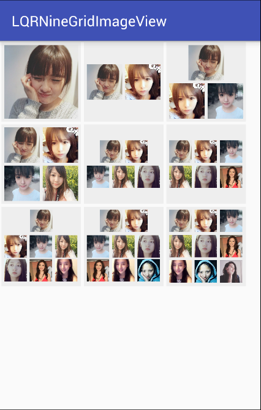

# LQRNineGridImageView

##***一、简介：***
参照[Android 仿微信群聊头像](http://blog.csdn.net/loften_93663469/article/details/51227541)文章学习开发的一个仿微信群头像九宫格控件，感谢博主Loften_93663469。

效果如下:

##***二、使用：***
###1、在自己项目中添加本项目依赖：

	compile 'com.lqr.ninegridimageview:library:1.0.0'

###2、布局中使用：

	<com.lqr.ninegridimageview.LQRNineGridImageView
        android:id="@+id/ngiv8"
        android:layout_width="110dp"
        android:layout_height="110dp"
        android:layout_below="@id/ngiv5"
        android:layout_margin="2dp"
        android:layout_toRightOf="@id/ngiv7"
        android:background="#eeeeee"
        app:imgGap="12dp"/>

app:imgGap="12dp"指头像间距，默认是8px。

###3、代码中使用：
####1)设置适配器：
    LQRNineGridImageViewAdapter adapter = new LQRNineGridImageViewAdapter<String>() {
        @Override
        protected void onDisplayImage(Context context, ImageView imageView, String s) {
            ImageLoaderManager.LoadNetImage(s, imageView);
        }

        //重写该方法自定义生成ImageView方式，用于九宫格头像中的一个个图片控件，可以设置ScaleType等属性
        @Override
        protected ImageView generateImageView(Context context) {
            return super.generateImageView(context);
        }
    };
	mNgiv1.setAdapter(adapter);
####2)设置数据源：
	List<String> mData1 = new ArrayList<>();
	...
	填充数据
	...
	mNgiv1.setImagesData(mData1);//会重画控件，使用适配器加载图片，所以要先设置适配器
